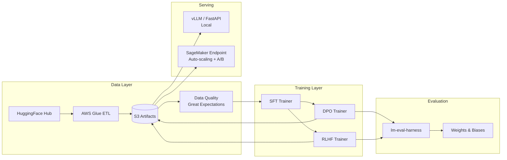

# AlignLLM — End-to-End LLM Alignment Pipeline on AWS

An end-to-end LLM alignment pipeline that takes pre-trained language models through Supervised Fine-Tuning (SFT), Direct Preference Optimization (DPO), and Reinforcement Learning from Human Feedback (RLHF) to produce a general-purpose chat assistant aligned for helpfulness, harmlessness, and honesty. Built with a dual-mode architecture — local development on consumer GPUs with small models (Qwen2.5-1.5B, Llama-3.2-1B) and cloud-scale training on AWS SageMaker with larger models (Llama-3.1-8B, Mistral-7B) — using parameter-efficient fine-tuning (LoRA/QLoRA), serverless data engineering (Glue + Athena), and production serving with auto-scaling endpoints.

---

## System Architecture



---

## Learning Path

This project is structured as a progressive learning journey. Study in order:

| # | Topic | Document | What You'll Learn |
|---|-------|----------|-------------------|
| 1 | Decoder Architectures | [docs/learning/data-engineering/LEARNING.md](docs/learning/data-engineering/LEARNING.md) | Transformer internals, attention, tokenization, data pipelines |
| 2 | Supervised Fine-Tuning | [docs/learning/sft/LEARNING.md](docs/learning/sft/LEARNING.md) | Instruction tuning, chat templates, loss masking |
| 3 | LoRA / QLoRA | [docs/learning/lora/LEARNING.md](docs/learning/lora/LEARNING.md) | Parameter-efficient fine-tuning, quantization, adapter merging |
| 4 | DPO | [docs/learning/dpo/LEARNING.md](docs/learning/dpo/LEARNING.md) | Direct Preference Optimization, Bradley-Terry model, beta tuning |
| 5 | RLHF | [docs/learning/rlhf/LEARNING.md](docs/learning/rlhf/LEARNING.md) | Reward modeling, PPO, KL divergence penalties |
| 6 | Evaluation | — | MT-Bench, MMLU, HellaSwag, TruthfulQA, reward accuracy |
| 7 | Serving | [docs/learning/serving/LEARNING.md](docs/learning/serving/LEARNING.md) | vLLM, PagedAttention, continuous batching, streaming |
| 8 | AWS SageMaker | [docs/learning/sagemaker/LEARNING.md](docs/learning/sagemaker/LEARNING.md) | Training jobs, endpoints, spot instances, auto-scaling |

---

## Tech Stack

| Category | Technologies |
|----------|-------------|
| **ML / DL** | PyTorch, HuggingFace Transformers, TRL (SFT/DPO/PPO), PEFT, bitsandbytes |
| **Data** | HuggingFace Datasets, AWS Glue ETL, Athena, Great Expectations, PyArrow |
| **Cloud** | AWS SageMaker (Training Jobs + Endpoints), S3, ECR, CloudWatch, IAM |
| **Serving** | vLLM (PagedAttention), FastAPI, SSE streaming, SageMaker Real-time Endpoints |
| **Evaluation** | lm-eval-harness (MMLU, HellaSwag, TruthfulQA), MT-Bench, scikit-learn |
| **IaC** | Terraform (modules: S3, ECR, SageMaker, Glue, Monitoring) |
| **Tracking** | Weights & Biases, Prometheus (local), CloudWatch (prod) |
| **Dev Tools** | Ruff, Black, mypy, pytest, pre-commit, GitHub Actions CI/CD |

---

## Repository Structure

```
distill-align-llm/
├── configs/
│   ├── local_small.yaml          # Local dev: Qwen2.5-1.5B + QLoRA
│   └── cloud_large.yaml          # Cloud: Llama-3.1-8B on SageMaker
├── src/distill_align/
│   ├── config/                   # YAML config loading + Pydantic models
│   ├── data/                     # Data processor, Glue ETL, quality validation
│   ├── training/                 # SFT, DPO, RLHF trainers
│   ├── evaluation/               # Eval harness (lm-eval + custom metrics)
│   ├── serving/                  # vLLM engine, FastAPI, SageMaker deployment
│   ├── monitoring/               # CloudWatch + Prometheus metrics
│   ├── tracking/                 # W&B experiment tracking
│   └── models/                   # Model loading, quantization, adapter merging
├── infrastructure/terraform/     # IaC: S3, ECR, SageMaker, Glue, Monitoring
├── docker/
│   ├── training/Dockerfile       # Training container (SageMaker-compatible)
│   └── serving/Dockerfile        # Inference container (vLLM + FastAPI)
├── docs/
│   ├── learning/                 # Deep-dive study notes per topic
│   ├── ARCHITECTURE.md           # System architecture diagrams
│   ├── RESULTS.md                # Benchmark results (post-training)
│   └── COST_ANALYSIS.md          # AWS cost breakdown
├── tests/                        # Unit + integration tests (moto for AWS)
├── scripts/                      # Utility scripts
├── .github/workflows/            # CI/CD: lint, test, deploy
├── Makefile                      # Dev commands (install, lint, test, check)
└── pyproject.toml                # Project config + dependencies
```

---

## Quick Start

### Prerequisites

- Python 3.10+
- CUDA-capable GPU (4GB+ VRAM for local mode)
- AWS CLI configured (for cloud mode)

### Local Mode

```bash
# Clone and install
git clone https://github.com/santoshadabala/distill-align-llm.git
cd distill-align-llm
make install

# Run SFT on Qwen2.5-1.5B (local, ~4GB VRAM)
python -m distill_align.training.sft --config configs/local_small.yaml

# Run DPO alignment
python -m distill_align.training.dpo --config configs/local_small.yaml

# Serve locally with vLLM + FastAPI
python -m distill_align.serving.api --model-path ./outputs/dpo

# Run evaluation
python -m distill_align.evaluation.harness --model-path ./outputs/dpo
```

### Cloud Mode (AWS SageMaker)

```bash
# Provision infrastructure
cd infrastructure/terraform && terraform init && terraform apply

# Launch SageMaker training job (Llama-3.1-8B, spot instances)
python -m distill_align.training.sft --config configs/cloud_large.yaml --cloud

# Deploy to SageMaker endpoint with auto-scaling
python -m distill_align.serving.sagemaker --config configs/cloud_large.yaml

# Run checks
make check
```

---

## Prior Work

This project builds on prior work in **knowledge distillation** from the [clinical-nlp-optimization](https://github.com/santoshadabala/clinical-nlp-optimization) project, which demonstrated:

- **Knowledge Distillation**: Bio_ClinicalBERT (110M params) → DistilClinicalBERT (66M params) with 40% size reduction and <2% F1 loss on clinical NER
- **Production ML on AWS**: SageMaker training jobs, S3 artifact management, CloudWatch monitoring
- **Data Engineering**: PySpark ETL pipelines for clinical text processing

**AlignLLM** extends this foundation from encoder models (BERT) to decoder models (LLMs), from distillation to alignment (SFT → DPO → RLHF), and from NER to open-ended generation — while scaling the AWS infrastructure to handle 7-8B parameter models with GPU training.

---

## Key Design Decisions

| Decision | Choice | Rationale |
|----------|--------|-----------|
| Fine-tuning approach | LoRA/QLoRA exclusively | Enables 7-8B model training on single A10G GPU; reduces trainable params by ~99% |
| Alignment methods | Both DPO and RLHF | DPO is simpler/stable; RLHF shows full reward-model pipeline; comparison is a differentiator |
| Serving engine | vLLM (local) + SageMaker (prod) | vLLM: PagedAttention + continuous batching; SageMaker: managed auto-scaling + A/B testing |
| Data engineering | AWS Glue + Athena | Serverless, cost-effective; demonstrates progression beyond PySpark/EMR |
| Experiment tracking | Weights & Biases | Industry standard; rich comparison dashboards; artifact versioning |
| Infrastructure as Code | Terraform (modular) | Cloud-agnostic, widely adopted, modular design with reusable components |
| Config management | YAML + Pydantic validation | Human-readable configs with runtime type safety and validation |
| Dual-mode architecture | Local + Cloud | Fast iteration locally; production-grade training on AWS with same codebase |

---

## Results

> **Note:** Results will be populated after training runs are complete.

| Model | Method | MT-Bench | MMLU | HellaSwag | TruthfulQA | Latency (p50) |
|-------|--------|----------|------|-----------|-------------|---------------|
| Qwen2.5-1.5B | Base | — | — | — | — | — |
| Qwen2.5-1.5B | + SFT | — | — | — | — | — |
| Qwen2.5-1.5B | + DPO | — | — | — | — | — |
| Qwen2.5-1.5B | + RLHF | — | — | — | — | — |
| Llama-3.1-8B | Base | — | — | — | — | — |
| Llama-3.1-8B | + SFT | — | — | — | — | — |
| Llama-3.1-8B | + DPO | — | — | — | — | — |
| Llama-3.1-8B | + RLHF | — | — | — | — | — |

See [docs/RESULTS.md](docs/RESULTS.md) for detailed benchmark analysis.

---

## License

MIT

---

*Built by [Santosh Adabala](https://github.com/santoshadabala) — AWS Certified Machine Learning Engineer*
