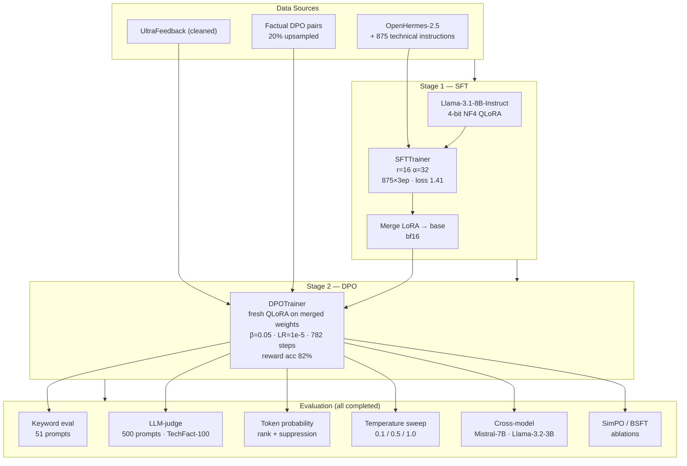

# distill-align-llm

An experiment in LLM alignment. I wanted to understand what DPO actually does to a model's factual knowledge — not just whether reward accuracy goes up, but whether the model gets better at answering domain-specific questions correctly.

Short answer: reward accuracy and factuality are not the same thing, and the gap between them depends a lot on how you measure factuality.

**[Live dashboard →](https://distill-align-llm-aembgrswzfay6bjupbnjpp.streamlit.app)**

[](https://python.org)
[](https://pytorch.org)
[](https://huggingface.co)
[]()
[](https://runpod.io)

---

## What I built

A full SFT → DPO pipeline on Llama-3.1-8B-Instruct using QLoRA. The training runs on RunPod (A100 SXM / RTX A6000). The whole thing — SFT, merge, DPO, eval — costs about $27.

After getting the pipeline working, I ran a bunch of experiments:

- **SFT scaling study** — 8 configs varying data size and epoch count
- **DPO with merged-SFT strategy** — merging the SFT adapter into base weights before DPO instead of stacking
- **Alternative methods** — SimPO, BSFT, IPO
- **Cross-model comparison** — Mistral-7B and Llama-3.2-3B with the same pipeline
- **Token probability analysis** — does the model know the answer but fail to generate it?
- **Semantic + LLM-judge evaluation** — because strict keyword matching on 51 prompts isn't a great benchmark
- **Temperature sweep** — does lowering temperature help recover suppressed knowledge?

---

## Main findings

**Reward accuracy ≠ factuality, but the gap depends on evaluation methodology.**

With strict keyword matching on 51 prompts, DPO achieves 82% reward accuracy but only 17.6% factuality — a 64-point gap. With a proper 500-prompt LLM-judge benchmark, factuality comes out at 75.7% — a 6.4-point gap. Same model, very different numbers depending on how you test it.

**The model knows the answers — it just doesn't always generate them.**

Token probability analysis (sprint3) showed that after SFT/DPO, the correct token ranks at median position 2. The model has the knowledge — it's a generation suppression problem. Lowering temperature to 0.1 recovers some of it (+3pp).

**Epoch count matters more than data volume.**

875 examples × 3 epochs outperforms 10,000 examples × 1 epoch on factuality. The 5K×3ep config had the lowest training loss but worse factuality than 875×3ep — too much generic data dilutes the technical signal.

**The AFG is model-size dependent.**

Llama-3.2-3B shows a 37-point gap; Mistral-7B shows 3.1 points; Llama-3.1-8B sits at 6.4 points on the proper benchmark. Smaller models struggle much more.

---

## Results

### Core pipeline (v5)

| Stage | Metric | Value |
|-------|--------|-------|
| SFT | Config | 875 examples × 3 epochs |
| SFT | Loss | 1.41 |
| DPO | Reward accuracy | 82% (peak 88%) |
| DPO | Loss | 0.52 |
| DPO | Factuality (51 prompts, keyword) | 17.6% |
| DPO | Factuality (500 prompts, LLM-judge) | **75.7%** |
| DPO | Factuality (500 prompts, keyword) | **78.8%** |

### SFT scaling study

| Config | Loss | Factuality | vs Base |
|--------|:----:|:----------:|:-------:|
| 875×1ep | 2.16 | 7.8% | -2.0pp |
| 875×3ep | 1.41 | **15.7%** | **+5.9pp** |
| 875×5ep | 1.11 | 15.7% | +5.9pp |
| 2.5K×1ep | 1.31 | 9.8% | 0.0pp |
| 2.5K×3ep | 1.10 | **15.7%** | **+5.9pp** |
| 5K×3ep | 1.02 | 7.8% | -2.0pp |
| 10K×1ep | 1.09 | 9.8% | 0.0pp |

The 5K×3ep result is the weird one — lowest loss, but factuality drops below 875×3ep. My hypothesis: the generic OpenHermes examples (4,125 out of 5,000) dilute the technical signal when you see them 3× per epoch. It's a single run so I can't rule out noise, but it's consistent with the general pattern.

### Token probability analysis

| Stage | Suppression rate | Forgetting rate | Median token rank | Mean correct prob |
|-------|:----------------:|:---------------:|:-----------------:|:-----------------:|
| Base | 33.3% | 47.1% | 76 | 0.108 |
| SFT (5ep) | 76.5% | 7.8% | **2** | 0.268 |
| DPO (5ep) | 76.5% | 5.9% | **2** | 0.297 |

Suppression = the model assigns high probability to the correct token but still generates something else. After SFT/DPO, almost all failures are suppression, not forgetting. The knowledge is there.

### Cross-model comparison

| Model | Reward acc | Factuality (judge) | AFG |
|-------|:----------:|:------------------:|:---:|
| Llama-3.1-8B (this project) | 82% | 75.7% | 6.4pp |
| Mistral-7B | 77% | 73.9% | 3.1pp |
| Llama-3.2-3B | 73% | 35.9% | 37.1pp |
| SimPO — Llama-3.1-8B | 73% | 64.9% | 8.1pp |

### Version history

| | v1 | v2 | v3 | v4 | v5 |
|---|---|---|---|---|---|
| GPU | RTX 3090 | RTX A5000 | A100 SXM | RTX A6000 | A100 SXM |
| SFT | Alpaca 1K×1ep | Alpaca 1K×1ep | Tech 3.9K×1ep | Tech 3.9K×1ep | Tech 875×3ep |
| DPO | Stacked β=0.1 | Stacked β=0.1 | Stacked β=0.1 | Merged β=0.05 | Merged β=0.05 |
| Peak reward acc | 50% | 75% | 68% | 83% | **88%** |
| Factuality | — | — | 9.8% | 5.9% | **17.6%** |

The jump from v3→v4 was switching from stacked adapters to merging SFT into base weights before DPO. That alone went from 68% → 83% peak reward accuracy.

---

## Training pipeline



---

## Repo structure

```
distill-align-llm/
├── configs/                    # training hyperparameters (YAML)
├── src/distill_align/
│   ├── config/                 # Pydantic config + YAML loader
│   ├── data/processor.py       # dataset loading, tokenization
│   ├── models/loader.py        # QLoRA + LoRA model setup
│   ├── serving/                # inference API
│   ├── monitoring/             # monitoring service
│   └── training/
│       ├── sft.py              # SFTTrainer wrapper
│       ├── dpo.py              # DPOTrainer wrapper
│       └── rlhf.py             # GRPOTrainer wrapper
├── scripts/
│   ├── run_sft.py              # SFT entry point
│   ├── run_dpo.py              # DPO entry point (--merge-sft flag)
│   ├── run_sft_scaling.py      # scaling study (8 configs)
│   ├── run_bsft.py             # BSFT training
│   ├── simpo.py                # SimPO training
│   ├── eval_factuality_all.py  # keyword eval: base vs SFT vs DPO
│   ├── eval_factuality_v2.py   # 500-prompt eval
│   ├── eval_semantic.py        # semantic + LLM-judge eval
│   ├── eval_token_probs.py     # token probability analysis
│   ├── token_rank_analysis.py  # rank + suppression
│   ├── probability_mass_analysis.py
│   ├── attention_shift_analysis.py
│   ├── temperature_sweep.py
│   ├── cross_method_eval.py    # cross-model comparison
│   └── compare_models.py
├── data/
│   ├── technical_instructions.jsonl   # 875 domain-specific SFT examples
│   ├── factual_dpo_pairs.jsonl        # factual preference pairs
│   ├── eval_factuality.jsonl          # 51-prompt benchmark
│   ├── eval_factuality_500.jsonl      # 500-prompt benchmark
│   ├── techfact_100.jsonl             # TechFact-100 (5 categories, 3 difficulty levels)
│   └── uncertainty_examples.jsonl
├── outputs/
│   ├── scaling/                # SFT scaling results (8 configs)
│   ├── sprint3/                # token prob, attention, temperature sweep
│   ├── eval_v2_judge/          # 500-prompt LLM-judge results
│   ├── cross_method/           # Mistral-7B, Llama-3.2-3B
│   ├── bsft_*/                 # BSFT/SimPO ablations
│   └── semantic_eval_results.json
├── dashboard/app.py            # Streamlit dashboard
├── docs/RESULTS.md             # detailed training logs
├── tests/                      # 44 passing tests
└── pyproject.toml
```

---

## Running it

```bash
git clone https://github.com/SantoshAdabala/distill-align-llm.git
cd distill-align-llm
make install
make test

# dashboard (no GPU needed)
pip install -r dashboard/requirements.txt
streamlit run dashboard/app.py
```

### Training on RunPod

```bash
pip install transformers accelerate peft datasets bitsandbytes trl
pip install -e .
huggingface-cli login

# SFT — ~12 min on A100
python scripts/run_sft.py --config configs/local_small.yaml

# DPO with merged-SFT — ~70 min
python scripts/run_dpo.py --config configs/local_small.yaml \
    --sft-adapter ./outputs/sft/final_adapter --merge-sft

# Factuality eval
python scripts/eval_factuality_all.py \
    --base-model meta-llama/Llama-3.1-8B-Instruct \
    --sft-adapter ./outputs/sft/final_adapter \
    --dpo-adapter ./outputs/dpo/dpo_adapter \
    --dpo-base ./outputs/sft_merged

# 500-prompt LLM-judge eval
python scripts/eval_factuality_v2.py

# Token probability analysis
python scripts/token_rank_analysis.py
python scripts/probability_mass_analysis.py
```

---

## Tech stack

| | |
|---|---|
| Training | PyTorch, HuggingFace Transformers, TRL (SFT/DPO/SimPO/GRPO), PEFT, bitsandbytes |
| Data | HuggingFace Datasets, UltraFeedback, OpenHermes-2.5 |
| Eval | sentence-transformers, TechFact-100, LLM-judge |
| Dashboard | Streamlit, Plotly |
| Testing | pytest, ruff |
| Infra | RunPod.io (RTX 3090 / A5000 / A6000 / A100 SXM) |

---

## Config

```yaml
model:
  model_id: "meta-llama/Llama-3.1-8B-Instruct"
  quantization:
    mode: "int4_nf4"
    use_double_quant: true
  lora:
    rank: 16
    alpha: 32
    target_modules: [q_proj, k_proj, v_proj, o_proj]

dpo:
  beta: 0.05
  learning_rate: 1e-5
```

---

## Still open

- Does the AFG pattern hold for instruction-tuned vs base models? The merged-SFT strategy essentially creates a fine-tuned base before DPO — might behave differently than pure base model DPO.
- The token suppression finding suggests calibration (temperature scaling) might help more than further training. Worth testing.
- Replication: the scaling study runs one seed per config. Some results (especially the 5K×3ep anomaly) could be noise.

---

## License

MIT
