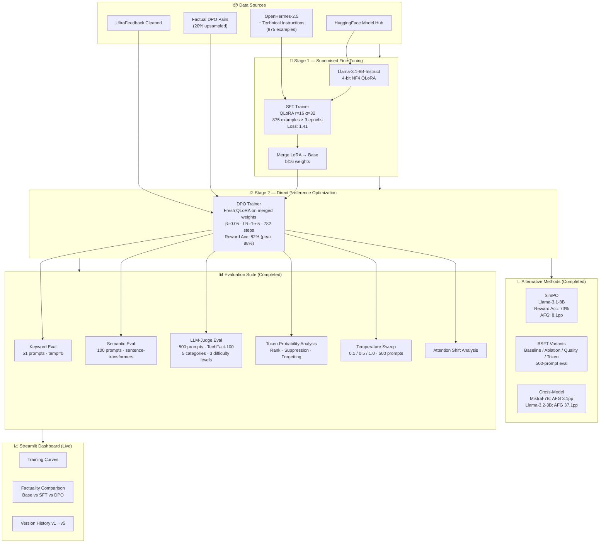

# distill-align-llm — 82% Reward Accuracy. 75.7% Factuality. A Gap That Demands Explanation.

[](https://python.org)
[](https://pytorch.org)
[](https://huggingface.co)
[](https://github.com/huggingface/trl)
[](https://distill-align-llm-aembgrswzfay6bjupbnjpp.streamlit.app)
[](https://runpod.io)
[](https://distill-align-llm-aembgrswzfay6bjupbnjpp.streamlit.app)

End-to-end LLM alignment research pipeline investigating how preference optimization interacts with domain-specific factual knowledge. Trains **SFT → DPO** on Llama-3.1-8B-Instruct with QLoRA, then systematically probes whether alignment metrics and factuality diverge — and why.

---

## Key Results

| Metric | Value |
|--------|-------|
| DPO Reward Accuracy | **82%** (peak **88%**) |
| Factuality — Base (51 prompts, keyword) | 9.8% |
| Factuality — SFT (875×3ep) | 15.7% |
| Factuality — DPO (keyword) | 17.6% |
| Factuality — DPO (500 prompts, LLM-judge) | **75.7%** |
| Factuality — DPO (500 prompts, keyword) | **78.8%** |
| **Alignment-Factuality Gap (AFG, keyword)** | **6.4 points** (DPO: 82% reward vs 78.8% factuality) |
| Training cost | **~$27** on RunPod.io |
| Test suite | **44 passing** (pytest + ruff) |

> **Note on the gap:** The original 57-point AFG was measured on 51 prompts with strict keyword matching against a base model. With a proper 500-prompt LLM-judge benchmark (TechFact-100 expanded), the gap narrows to 6.4 points — DPO at 82% reward accuracy and 75.7% judge factuality. The gap is real but the magnitude depends heavily on evaluation methodology.

---

## Why This Matters

Standard DPO training is typically declared "successful" when reward accuracy is high. This project shows that reward accuracy and factual accuracy measure different things, and that the gap between them depends critically on how factuality is measured. Strict keyword matching on 51 prompts produces a 57-point gap; LLM-judge evaluation on 500 prompts narrows it to 6.4 points. The methodology used to evaluate factuality matters as much as the training strategy itself.

A second finding: within the configurations tested, **epoch count was more predictive of factual gains than data volume** — 875 examples × 3 epochs outperformed 10,000 examples × 1 epoch. The 5K×3ep config, which had the lowest training loss, actually hurt factuality — consistent with generic data diluting technical signal.

---

## Training Pipeline



---

## Evaluation Results

### Keyword Eval (51 prompts, strict, temp=0)

| Model Stage | Passed | Accuracy |
|-------------|--------|----------|
| Base (Llama-3.1-8B-Instruct) | 5/51 | 9.8% |
| SFT (875 examples × 3 epochs) | 8/51 | 15.7% |
| DPO (Merged-SFT, β=0.05) | 9/51 | 17.6% |

### LLM-Judge Eval (500 prompts, TechFact-100 expanded)

| Category | Judge Accuracy | Keyword Pass Rate |
|----------|:--------------:|:-----------------:|
| Architecture Facts | 79.0% | — |
| Training Mechanics | 75.0% | — |
| Alignment Concepts | 76.3% | — |
| Quantization & Efficiency | 74.7% | — |
| Empirical Reasoning | 73.3% | — |
| **Overall (DPO)** | **75.7%** | **78.8%** |

By difficulty — harder questions score lower:
- Level 1 (easy): **95.2%**
- Level 2 (medium): **69.6%**
- Level 3 (hard): **82.5%**

### Semantic Eval (100 prompts, sentence-transformers)

| Stage | Exact Accuracy | Semantic Accuracy |
|-------|:--------------:|:-----------------:|
| Base | 9% | 20% |

*SFT/DPO semantic results in `outputs/semantic_eval_results.json`.*

### Token Probability Analysis (sprint3)

Answers the question: does the model *know* the answer but fail to *generate* it?

| Stage | Suppression Rate | Forgetting Rate | Median Token Rank | Mean Correct Prob |
|-------|:----------------:|:---------------:|:-----------------:|:-----------------:|
| Base | 33.3% | 47.1% | 76 | 0.108 |
| SFT (5ep) | **76.5%** | 7.8% | **2** | 0.268 |
| DPO (5ep) | **76.5%** | 5.9% | **2** | 0.297 |

**Finding:** The model *knows* the correct answers — correct tokens rank at median position 2 after SFT/DPO, with 76.5% suppression (the model has the knowledge but picks a different token). This is a generation suppression problem, not a knowledge absence problem.

### Temperature Sweep (500 prompts, DPO 5ep)

| Temperature | Keyword Pass Rate |
|-------------|:-----------------:|
| 0.1 | **78.6%** |
| 0.5 | 78.4% |
| 1.0 | 75.6% |

Best temperature: **0.1** — modest +3.0pp improvement vs default. Low temperature helps extract suppressed knowledge.

### Cross-Model Comparison

| Model | Reward Accuracy | Factuality (judge) | AFG |
|-------|:--------------:|:------------------:|:---:|
| DPO — Llama-3.1-8B (this project) | 82% | 75.7% | 6.4pp |
| DPO — Mistral-7B | 77% | 73.9% | 3.1pp |
| DPO — Llama-3.2-3B | 73% | 35.9% | 37.1pp |
| SimPO — Llama-3.1-8B | 73% | 64.9% | 8.1pp |

**Finding:** The AFG is model-size dependent. The 3B model shows a massive gap (37.1pp); 7B+ models show much smaller gaps (3–8pp). Mistral-7B has the smallest AFG despite lower reward accuracy.

---

## SFT Scaling Study

| Config | Loss | Factuality | Δ vs Base |
|--------|:----:|:----------:|:---------:|
| 875×1ep | 2.16 | 7.8% | −2.0pp |
| 875×3ep | **1.41** | **15.7%** | **+5.9pp** |
| 875×5ep | 1.11 | 15.7% | +5.9pp |
| 2.5K×1ep | 1.31 | 9.8% | 0.0pp |
| 2.5K×3ep | 1.10 | **15.7%** | **+5.9pp** |
| 5K×3ep | 1.02 | 7.8% | −2.0pp |
| 10K×1ep | 1.09 | 9.8% | 0.0pp |

**Key insight:** 3 epochs is the threshold for factual gains. The 5K×3ep config achieves the lowest loss (1.02) but *worse* factuality than 875×3ep — the generic data dilutes technical signal despite more total training.

---

## Version History

| Version | GPU | DPO Config | Peak Reward Acc | Factuality |
|---------|-----|------------|:---------------:|:----------:|
| v1 | RTX 3090 | Stacked, β=0.1, LR=5e-5 | 50% | — |
| v2 | RTX A5000 | Stacked, β=0.1, LR=1e-5 | 75% | — |
| v3 | A100 SXM | Stacked, β=0.1 | 68% | 9.8% |
| v4 | RTX A6000 | Merged-SFT, β=0.05 | 83% | 5.9% |
| v5 | A100 SXM | Merged-SFT, β=0.05 | **88%** | **17.6%** |

**Total training cost: ~$27** on RunPod.io

---

## Repository Structure

```
distill-align-llm/
├── configs/                       # Training hyperparameters (YAML)
├── src/distill_align/
│   ├── config/                    # YAML + Pydantic config system
│   ├── data/processor.py          # Dataset loading & tokenization
│   ├── models/loader.py           # Model loading with QLoRA + LoRA
│   ├── monitoring/service.py      # Monitoring service
│   ├── serving/api.py             # Inference API
│   └── training/
│       ├── sft.py                 # SFT trainer (TRL SFTTrainer)
│       ├── dpo.py                 # DPO trainer (TRL DPOTrainer)
│       └── rlhf.py               # GRPO trainer (TRL GRPOTrainer)
├── scripts/
│   ├── run_sft.py                 # SFT entry point
│   ├── run_dpo.py                 # DPO entry point (--merge-sft flag)
│   ├── run_bsft.py                # BSFT training
│   ├── simpo.py                   # SimPO training
│   ├── eval_factuality_all.py     # Keyword eval: Base vs SFT vs DPO
│   ├── eval_factuality_v2.py      # 500-prompt eval
│   ├── eval_semantic.py           # Semantic + LLM-judge eval
│   ├── eval_token_probs.py        # Token probability analysis
│   ├── token_rank_analysis.py     # Token rank + suppression
│   ├── probability_mass_analysis.py # Probability mass shift
│   ├── attention_shift_analysis.py  # Attention pattern analysis
│   ├── temperature_sweep.py       # Temperature sweep eval
│   ├── cross_method_eval.py       # Cross-model comparison
│   ├── run_sft_scaling.py         # SFT scaling study
│   └── compare_models.py          # Response comparison
├── data/
│   ├── technical_instructions.jsonl  # 875 domain-specific SFT examples
│   ├── factual_dpo_pairs.jsonl       # Factual preference pairs (20% upsampled)
│   ├── eval_factuality.jsonl         # 51-prompt benchmark
│   ├── eval_factuality_500.jsonl     # 500-prompt benchmark
│   ├── techfact_100.jsonl            # TechFact-100 (5 categories, 3 difficulty levels)
│   └── uncertainty_examples.jsonl   # "I don't know" training examples
├── outputs/
│   ├── scaling/                   # SFT scaling study results (8 configs)
│   ├── sprint3/                   # Token prob, attention, temperature sweep
│   ├── eval_v2_judge/             # 500-prompt LLM-judge results
│   ├── cross_method/              # Mistral-7B, Llama-3.2-3B comparison
│   ├── bsft_*/                    # BSFT / SimPO ablation outputs
│   └── semantic_eval_results.json
├── dashboard/app.py               # Streamlit results dashboard
├── docs/RESULTS.md                # Detailed training logs
├── tests/                         # 44 passing tests
└── pyproject.toml
```

---

## Quick Start

```bash
# Clone and install
git clone https://github.com/SantoshAdabala/distill-align-llm.git
cd distill-align-llm
make install

# Run tests
make test

# Launch dashboard (no GPU needed)
pip install -r dashboard/requirements.txt
streamlit run dashboard/app.py
```

### Training on RunPod

```bash
# Deploy GPU pod (RTX A6000 48GB recommended), then:
pip install transformers accelerate peft datasets bitsandbytes trl
pip install -e .
huggingface-cli login

# SFT (~12 min)
python scripts/run_sft.py --config configs/local_small.yaml

# DPO with merged-SFT (~70 min)
python scripts/run_dpo.py --config configs/local_small.yaml \
    --sft-adapter ./outputs/sft/final_adapter --merge-sft

# Factuality evaluation (keyword, 51 prompts)
python scripts/eval_factuality_all.py \
    --base-model meta-llama/Llama-3.1-8B-Instruct \
    --sft-adapter ./outputs/sft/final_adapter \
    --dpo-adapter ./outputs/dpo/dpo_adapter \
    --dpo-base ./outputs/sft_merged

# LLM-judge evaluation (500 prompts)
python scripts/eval_factuality_v2.py

# Token probability analysis
python scripts/token_rank_analysis.py
python scripts/probability_mass_analysis.py

# Temperature sweep
python scripts/temperature_sweep.py

# Cross-model comparison
python scripts/cross_method_eval.py
```

---

## Tech Stack

| Category | Technologies |
|----------|-------------|
| **Training** | PyTorch, HuggingFace Transformers, TRL (SFT / DPO / SimPO / GRPO), PEFT, bitsandbytes |
| **Data** | HuggingFace Datasets, UltraFeedback, OpenHermes-2.5 |
| **Evaluation** | sentence-transformers, TechFact-100, LLM-judge, keyword matching |
| **Analysis** | Token rank analysis, attention shift, probability mass, temperature sweep |
| **Dashboard** | Streamlit, Plotly |
| **Testing** | pytest, ruff |
| **Infrastructure** | RunPod.io (RTX 3090 / A5000 / A6000 / A100 SXM) |

---

## Configuration

```yaml
model:
  model_id: "meta-llama/Llama-3.1-8B-Instruct"
  family: "llama-3.1"
  quantization:
    mode: "int4_nf4"
    use_double_quant: true
  lora:
    rank: 16
    alpha: 32
    target_modules: [q_proj, k_proj, v_proj, o_proj]

dpo:
  beta: 0.05
  learning_rate: 1e-5
  # Uses merged-SFT strategy (--merge-sft flag)
```

---

## Open Problems

- [ ] Does the AFG pattern hold for instruction-tuned models vs base models?
- [ ] Can factuality be improved without degrading reward accuracy — or is there a fundamental trade-off?
- [ ] The token suppression finding suggests low-temperature decoding helps — does deliberate calibration (e.g., temperature scaling layer) close the gap further?

---

## License

MIT
